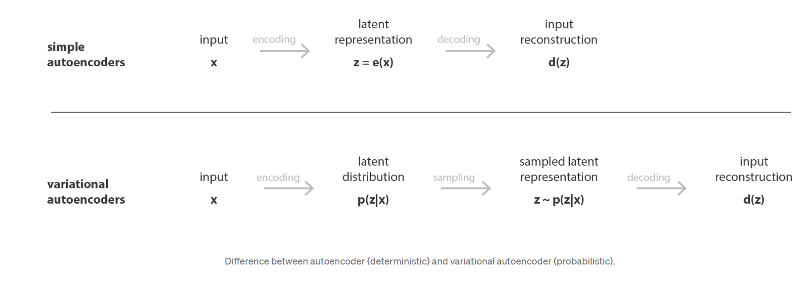

# Autoencoders

## -  Autoencoders: 
### Are neural networks that are trained to attempt to copy their input to their output. They work by compressing the input into a __latent-space representation__, and then reconstructing the output from this representation. This kind of network is composed of two parts:
- ###  An __encoder__ function that converts the input to an internal representation.
- ### A __decoder__ function that converts the internal representation to the output.

- ### Latent space is a representation of data that is learned by a neural network. This is an example of unsupervised learning. The network learns the latent representation through __self-supervision__. The network is trained to reconstruct its input, and as a result, one of the hidden layers can be extracted and used as a representation of the input.

## - Core Architecture of Autoencoders:
### An autoencoder is composed of two parts: 
- ### __Encoder__ : maps the input to a latent-space representation (Code).
- ### __Code (Encoded Layer or Latent Space)__: is a represents the compressed input that is fed to the decoder.
- ### __Decoder__: maps the latent space representation back to the original dimension  (reconsturction) of the input.

 

## - Math behind Autoencoders:

 

### The encoder function, denoted by ϕ, maps the original data X, to a latent space F, which is present at the bottleneck. The decoder function, denoted by ψ, maps the latent space F at the bottleneck to the output. The output, in this case, is the same as the input function.
### The objective of an autoencoder is to minimize the reconstruction error, which is the error between the input and the output. The reconstruction error is calculated using a loss function. The loss function depends on the type of data being used. For example, for real-valued inputs, the mean squared error (MSE) loss function is used. The loss function is minimized using an optimization algorithm such as gradient descent. The parameters of the encoder and decoder functions are learned during the training process. 

 

### - The encoding network can be represented by the standard neural network function passed through an activation function, where z is the latent dimension.

 

### -  Similarly, the decoding network can be represented in the same fashion, but with different weight, bias, and potentially activation functions being used.

 

### - The loss function is the difference between the input and the output of the autoencoder. The loss function is minimized using an optimization algorithm such as gradient descent. The parameters of the encoder and decoder functions are learned during the backpropagation process.

 

--------------------------------

## - Types of Autoencoders:
1. ###  __Denoising Autoencoders__: is designed to remove noise from the input data. It is trained to map noisy inputs to clean outputs. The encoder is forced to learn a compressed representation of the input data, which is robust to noise. The decoder is trained to reconstruct the input from the compressed representation. 

 

2. ### __Sparse Autoencoders__: 
### A sparse autoencoder is simply an autoencoder whose training criterion involves a sparsity penalty. In most cases, we would construct our loss function by penalizing activations of hidden layers so that only a few nodes are encouraged to activate when a single sample is fed into the network.

 

### The intuition behind this method is that, for example, if a man claims to be an expert in mathematics, computer science, psychology, and classical music, he might be just learning some quite shallow knowledge in these subjects. However, if he only claims to be devoted to mathematics, we would like to anticipate some useful insights from him. And it’s the same for autoencoders we’re training — fewer nodes activating while still keeping its performance would guarantee that the autoencoder is actually learning latent representations instead of redundant information in our input data.

 

 

### Sparsity penalty: L1 regularization is used to penalize the activations of the hidden layer. 

 

### Loss Function:

### - we add the third term which penalizes the absolute value of the vector of activations a in layer h for sample i. Then we use a hyperparameter to control its effect on the whole loss function. And in this way, we do build a sparse autoencoder.

 

3. ### __Variational Autoencoders__:

### Limitations of Autoencoders:
- ### Autoencoders are data-specific, which means that they will only be able to compress data similar to what they have been trained on. This is because the model is learning the identity function, so it only knows how to reconstruct what it has learned to encode. But still no real way to produce any new content. 

### Variational Autoencoders (VAEs) are a type of autoencoder that add constraints to the latent space, forcing it to contain well-formed data. This constraint allows us to generate new data. VAEs are a generative model, meaning they allow us to generate new images we haven’t seen before.

 

 

### - Encoder: The encoder takes in an image and outputs a hidden vector of mu and sigma values. These values define the mean and standard deviation of a normal distribution. We then sample a random epsilon value from that distribution.

> ### __NOTE:__  standard deviation means how much the data is spread out. A low standard deviation means that most of the numbers are close to the mean (average) value. A high standard deviation means that the numbers are more spread out.

 

### - Decoder: The decoder takes the sampled epsilon value and decodes it back to the original image. The decoder is trained to minimize the difference between the decoded image and the input image. The decoder is also trained to minimize the difference between the mu and sigma values of the hidden vector and the mu and sigma values of the encoded image.

 

### __Reparameterization Trick__:
### To generate a sample z for the decoder during training, you can sample from the latent distribution defined by the parameters outputted by the encoder, given an input observation x. However, this sampling operation creates a bottleneck because backpropagation cannot flow through a random node.
### To address this, use a reparameterization trick. In our example, you approximate z using the decoder parameters and another parameter ε as follows:

 

### where μ and σ represent the mean and standard deviation of a Gaussian distribution respectively. They can be derived from the decoder output. The ε can be thought of as a random noise used to maintain stochasticity of z. Generate ε from a standard normal distribution.
### The latent variable z is now generated by a function of μ, σ and ε, which would enable the model to backpropagate gradients in the encoder through μ and σ respectively, while maintaining stochasticity through ε.

 

## Autoencoders Applications:
1. ### Noise Reduction.
2. ### Anomaly Detection.
3. ### Image Colorization.
