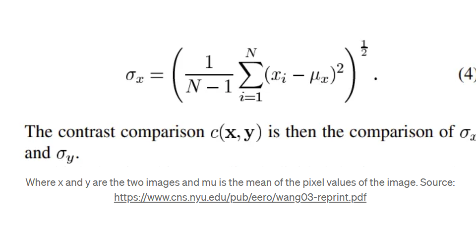

### Structural Similarity Index Measure (SSIM):  
#### is a perceptual metric that measures the similarity between two images. It is commonly used as a loss function in Generative Adversarial Networks (GANs) to guide the training process.

#### - The purpose of using SSIM as a loss function in GANs is to encourage the generated images to have similar structural patterns and textures as the real images. By incorporating SSIM into the loss function, GANs can produce more visually appealing and realistic images.

- ### SSIM metric extracts three key features from the images:  
    - #### Luminance (l) (brightness):  
        - #### The average pixel intensity of the image.  
        - #### is measured by averaging over all the pixel values. Its denoted by μ (Mu) and the formula is given below,

        

    - #### Contrast (c):  
        - ####  contrast measures the difference in brightness between different parts of the image. High contrast means there is a large difference in brightness, so the bright areas are much brighter and the dark areas much darker. Low contrast means the differences in brightness are more subtle.intensities.  
        - ##### It is measured by taking the standard deviation (square root of variance) of all the pixel values. It is denoted by σ (sigma) and represented by the formula below,

        

    - #### Structure (s):  
        - #### refers to the spatial distribution and relationship of intensities in different parts of an image. When structure is defined as the covariance of the pixel intensities, it's a measure of how changes in pixel intensity in one part of the image relate to changes in another part. 

        

#### - Here's a more technical explanation:
1. #### Mean Intensity: First, the mean (average) intensity of all the pixels in the image is calculated. This gives a baseline level of brightness.

2. #### Deviation from the Mean: For each pixel, its deviation from the mean intensity is calculated. This deviation is how much brighter or darker each pixel is compared to the average brightness of the whole image.

3. #### Standard Deviation: The standard deviation of these deviations is then calculated. Standard deviation is a statistical measure that quantifies the amount of variation or dispersion in a set of values. In the context of an image, a high standard deviation means that the pixel intensities vary widely from the mean (high contrast), while a low standard deviation means that the pixel intensities are closer to the mean (low contrast).

4. #### Covariance, in statistical terms, is a measure of how much two variables change together. If you're comparing two images, or two parts of an image, and is a measure of how much the pixel intensities in one image change as the pixel intensities in the other image change. If the covariance is high, then the pixel intensities in the two images change together, and if the covariance is low, then the pixel intensities in the two images change independently of each other.

#### + comparison functions that can compare the two given images on these parameters, and finally, a combination function that combines them all. Here, we define the comparison functions and finally the combination function that yields the similarity index value:

- #### luminance comparison function: It is defined by a function, l(x, y) which is shown below. μ (mu) represents the mean of a given image. x and y are the two images being compared.

