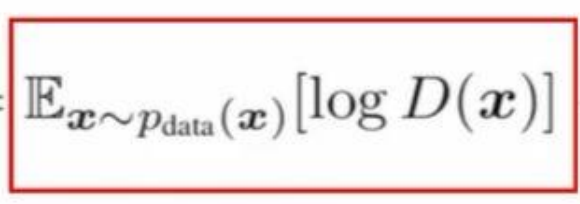
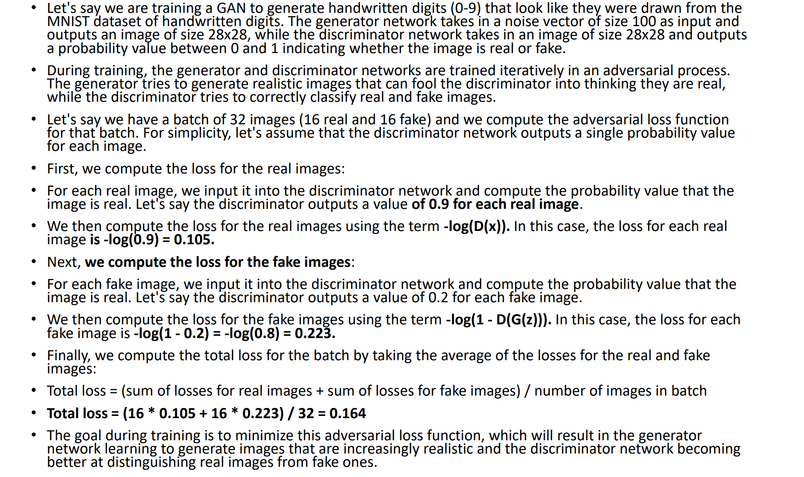
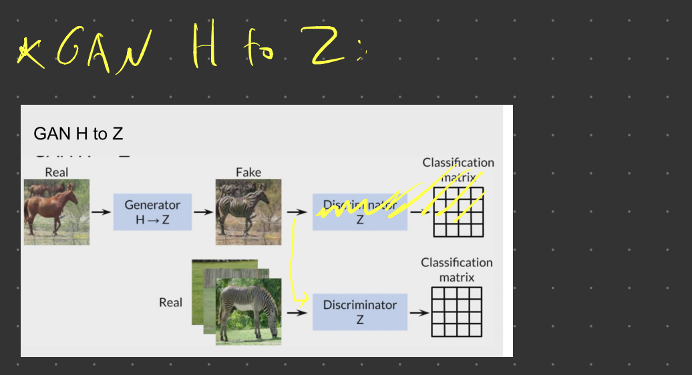

### what dose Gans do?
#### The main focus for GAN (Generative Adversarial Networks) is to generate data from scratch, mostly images. 

#### - GANs are made up of two networks, a generator and a discriminator. The generator is responsible for generating new data instances, while the discriminator evaluates them for authenticity; i.e. the discriminator decides whether each instance of data that it reviews belongs to the actual training dataset or not.

### -  The Competition Between Generator and Discriminator
- #### Generator: learns to make fakes that look real.
- #### Discriminator: learns to distinguish real from fake.(classifiers). In other words , they try to model the probability of a class Y according to a set of features X, P(Y|X).

### Why we use the noise? 
#### if we don’t use the noise, we will generate the same realistic image of the cat each time and this is not fun and not really interesting as we know now that generative models try to capture the probability distribution of the features X, with the addition of the noise ᶓ the model will generate realistic and diverse representations of this class Y.

#### Loss function for the generator and the discriminator:

### Where:
- G = Generator 
- D = Discriminator 
- Pdata(x) = distribution of real data 
- P(z) = distribution of generator 
- x = sample from Pdata(x) 
- z = sample from P(z) 
- D(x) = Discriminator network 
- G(z) = Generator network

#### to see if the data is real we use this loss function:

#### to see if the data is fake we use this loss function:

> __NOTE:__ the generator tries to minimize the loss function and the discriminator tries to maximize it. 
real --> 1, fake --> 0.

### example:

#### in term -log(D(x)) we use minus beacues we dont want to have a negative value. same for -log(1-D(G(z))).

  
   
  

#### in other words: The generator is trained to fool the discriminator, it wants to output data that looks as close as possible to real, so it tries to minimize the difference between the real and fake data distributions (total loss). The discriminator is trained to correctly classify real and fake data, so it tries to maximize this difference.

#### Gans Models:

  
   
  

### 5 steps to train a GAN:
#### 1. Define GAN architecture based on the application.
#### 2. Train the discriminator network to distinguish between real and fake data.
#### 3. Train the generator to fool the discriminator.
#### 4. Continue discriminator and generator training for a number of epochs.
### 5. Save the generator model for future use, to create new realistic fake data.

---

### 1. CycleGAN: 
#### is used to translate (transforming) images from one domain to another domain without the need for paired training data. In other words: is to learn a mapping between some dataset, X, and another dataset, Y. For example, X could be a dataset of horse images and Y a dataset of zebra images.

-- 
### Paired vs Unpaired Data:

#### 1. Paired Data: refers to datasets where each input data point is directly associated with a corresponding output data point. This pairing implies a clear, one-to-one relationship between the source and target data. Example: A common example is image-to-image translation tasks where the input is an image in one style (e.g., a sketch) and the corresponding output is the same image in another style (e.g., a colored version).

#### 2. Unpaired Data: refers to datasets where there is no direct association between input and output data points. This means that there is no clear, one-to-one relationship between the source and target data. Example: A common example is image-to-image translation tasks where the input is an image in one style (e.g., a photo) and the corresponding output is an image in another style (e.g., a painting).

--- 

### CycleGAN Architecture:
#### - requierd 2 gan models: 2 generators and 2 discriminators .

  
   

1. ### Gan H --> Z:

  
   

2. ### Gan Z --> H:

  
   

3. ### Putting it all together:

--- 

### Adversarial Loss: 

### CycleGAN Loss Function:
#### - we have four loss functions:

  
   
   

--- 

### Other Sources: [medium](https://medium.com/analytics-vidhya/the-beauty-of-cyclegan-c51c153493b8)
#### CycleGANs are composed of two generators and two discriminators.
#### The first generator, G, takes an image, x, from X, and maps it into ŷ, such that ŷ is hopefully indistinguishable from real images belonging to Y.
### A discriminator, Dy, then attempts to classify whether an image is real, and was sampled from Y, or whether the image is fake, and was generated by G.
### Formally, the objective for the mapping function G: X -> Y and its corresponding discriminator Dy is:

#### Simply put, this objective measures how close to 1 the discriminator outputs for real images, log Dy(y), and how close to 0 the discriminator outputs for fake images, log(1-Dy(G(x))).
#### a second generator, F. F is the inverse of G; it takes an image from Y and returns x̂ , an image indistinguishable from images in X. F has its own discriminator, Dx, that attempts to classify whether an image was generated by F, or was sampled from X. The same loss function applied to G and Dy is applied to F and Dx.

#### Cycle consistency states that if G translates x into ŷ, F should be able to translate ŷ back into x — and vice versa.

#### For example, if we take a sentence from English and translate it to French, we should be able to translate that sentence back into the original English sentence.

#### More formally speaking, the cycle consistency loss is represented as:

#### …where ||x|| denotes the mean absolute error, or MAE, of x.

#### Taking the mean absolute error of x and y, where x and y are both n-dimensional vectors, is a method of measuring the distance between those vectors. MAE takes the absolute distance of each element, and than averages that into a single number. The smaller the MAE, the closer x and y are to each other.

#### Now we have three separate losses, the adversarial loss of G vs. Dy, the adversarial loss of F vs. Dx, and the cycle consistency loss for both generators. Technically, this is enough to train a CycleGAN, however it is often beneficial to add a fourth loss, the identity loss.

#### The identity loss is simple, G(y) should ≈ y and F(x) should ≈ x. Formally, the identity loss is written as:

#### Adding an identity loss generally helps preserve color and tint in translated images, especially for photo to image generations.

#### We have four losses, the two adversarial losses, the cycle loss and the identity loss, but these losses aren’t equally important. We may want to give a greater importance to the cycle loss than the adversarial loss or vice versa.

#### To solve this, the authors introduce λ. In the final loss equation, the term for cycle loss is multiplied by λ, as to give it more or less importance. The authors set λ equal to 10 for their experiments.

#### So if we put it all together, the authors define this as the full loss function:

#### To implement the CycleGAN: [CycleGAN](https://github.com/gokriznastic/pytorch-udacity-nanodegree/tree/master/5.%20Generative%20Adversarial%20Networks/L4%20cycle-gan)