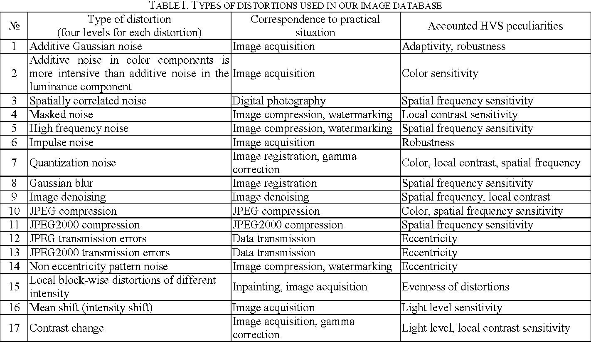

## Image Auality assessmen: 
### No-Reference IQA:
### Distorted Image: As the name suggests, a distorted image is a version of the original image that is distorted by blur, noise, watermarking, color transformations, geometric transformations and so on and so forth.

 

### BRISQUE calculates the no-reference image quality score for an image using the Blind/Referenceless Image Spatial Quality Evaluator (BRISQUE).

### BRISQUE score is computed using a support vector regression (SVR) model trained on an image database with corresponding differential mean opinion score (DMOS) values. The database contains images with known distortion such as compression artifacts, blurring, and noise, and it contains pristine versions of the distorted images. The image to be scored must have at least one of the distortions for which the model was trained.

 

### If the BRISQUE score is low, the image is of high quality. If the BRISQUE score is high, the image is of low quality.