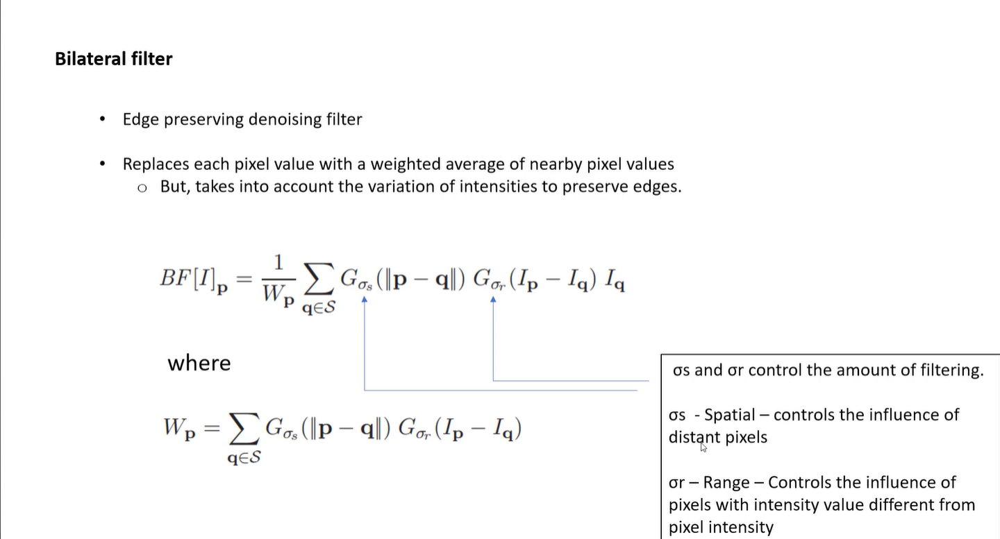
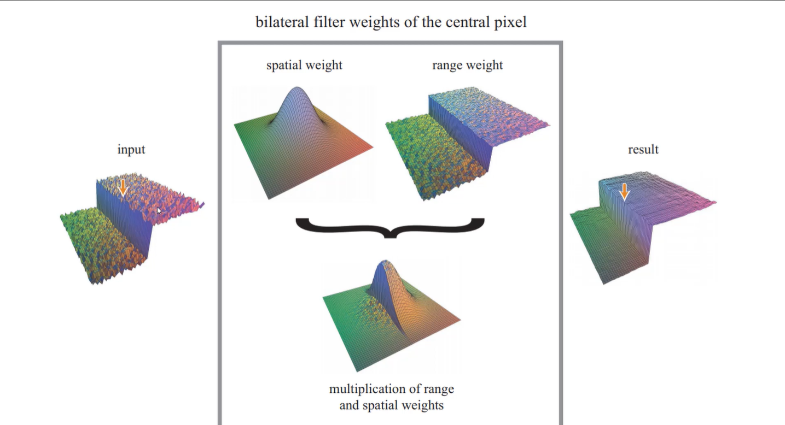

##  Bilateral Filter
### Is a non-linear, edge-preserving and noise-reducing smoothing filter for images. It replaces the intensity of each pixel with a weighted average of intensity values from nearby pixels. This weight can be based on a Gaussian distribution. Crucially, the weights depend not only on Euclidean distance of pixels, but also on the radiometric differences (e.g., range differences, such as color intensity, depth distance, etc.). This preserves sharp edges.

 

### Replaces each pixel with a weighted average of itself and its neighbors, where the weight decreases with distance from the pixel.

 
 

### Where: 1/Wp is the normalization factor, which ensures that the sum of all the weights is 1. The second term is the spatial component, which is a function of the distance between the center pixel and the neighboring pixel. The third term is the range component, which is a function of the difference between the intensity of the center pixel and the intensity of the neighboring pixel. The spatial and range components are combined to form the weight of the neighboring pixel. The weight of the neighboring pixel is high if the neighboring pixel is close to the center pixel and if the intensity of the neighboring pixel is similar to the intensity of the center pixel. The weight of the neighboring pixel is low if the neighboring pixel is far from the center pixel and if the intensity of the neighboring pixel is different from the intensity of the center pixel. The neighboring pixels with high weights are used to restore the center pixel. The neighboring pixels with low weights are not used to restore the center pixel.

 

