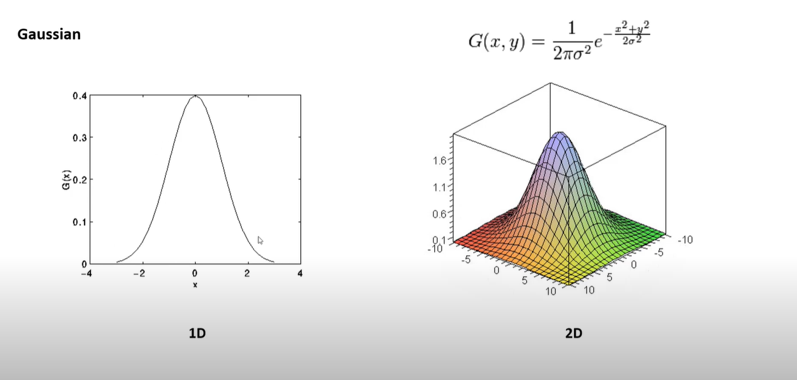

## Gaussian denoising filter
### Is used in reducing noise in the image and also the details of the image. Gaussian Filter is always preferred compared to the Box Filter.

 

### Where, sigma is the standard deviation of the Gaussian distribution. If it is not given, it is calculated using the kernel size.
### x and y are the distances from the origin in the horizontal and vertical axis, respectively.

### The Gaussian filter alone is not enough to remove noise from the image. It is always used with other filters like Median filter, Bilateral filter in order to remove noise effectively.

 

 

### Where 1/273 is the normalization factor. The sum of all the elements in the kernel is 273. The normalization factor is used to normalize the value of the pixels in the image.