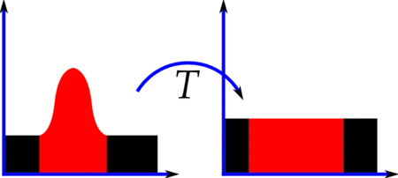
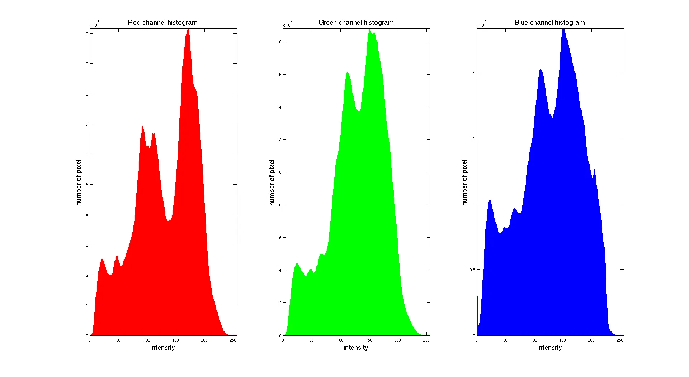

## Histogram equalization and CLAHE

### What is Histogram of an image ? 
### is the graphical interpretation of the image’s pixel intensity values. It can be interpreted as the data structure that stores the frequencies of all the pixel intensity levels in the image. In onther words, is a concept which counts the number of pixels having the same value and shows them in a specific range.

 

 

### In general, existing pixel values range from 0 to 255 unless they are not normalized, 0 to 1 if they are normalized.

 

### RGB images have 3 channels, which R,G, and B colors are represented in divided channels and full of the value between 0 and 255.

 

 

### __What is Histogram Equalization?__
### Histogram Equalization is an image processing technique that adjusts the contrast of an image by using its histogram. To enhance the image’s contrast, it spreads out the most frequent pixel intensity values or stretches out the intensity range of the image. By accomplishing this, histogram equalization allows the image’s areas with lower contrast to gain a higher contrast. This adjustment of contrast is done by transforming the image’s intensity distribution into a new one. The new intensity distribution is a uniform distribution, which has equal probabilities for all the pixel intensity values.

### ___Yhy we need to use Histogram Equalization?___
### The main purpose of histogram equalization is to improve the contrast of an image. It is a very useful technique for improving the contrast of images that have a large number of pixels with low and high pixel intensity values. Histogram equalization is also useful for images with backgrounds and foregrounds that are both bright or both dark. In addition, it can be used to normalize the intensity distribution of an image.

### ___How to use Histogram Equalization?___
### Histogram equalization is a method that improves the contrast in an image, in order to stretch out the intensity range. To do this, it spreads out the most frequent intensity values in an image. The algorithm works by computing the histogram of the image and using the histogram to calculate the transformation function. This transformation function is then applied to every pixel in the image, in order to spread out the most frequent intensity values.

 

### ___What is CLAHE?___
### CLAHE stands for Contrast Limited Adaptive Histogram Equalization. It is an extension of the AHE algorithm, which uses a contrast enhancement technique that overcomes the limitations of standard histogram equalization. CLAHE is an adaptive algorithm, which means it computes multiple histograms for an image. It divides the image into small blocks called tiles and computes the histogram for each tile. Then, it uses linear interpolation to map the original pixel values to a new value that spreads out the most frequent intensity values. This technique is used to improve the local contrast of an image.

###  Grayscale:

### Grayscale is a color space that represents images using shades of gray.
### It has only one channel, which represents the intensity of the color.
### Each pixel in a grayscale image has a single value ranging from 0 (black) to 255 (white).
### Grayscale images are devoid of color information and are commonly used in black and white photography or for representing images where color is not necessary.

### Lab (CIELAB):
### Lab is a color space designed to represent all perceivable colors, including both visible and non-visible colors.
### It consists of three channels: L (lightness), a (green-red), and b (blue-yellow).
### The L channel represents the lightness value from 0 (black) to 100 (white).
### The a channel represents the green-red axis, where negative values represent green and positive values represent red.
### The b channel represents the blue-yellow axis, where negative values represent blue and positive values represent yellow.
### Lab color space is device-independent and is used in color management systems to ensure accurate color reproduction across different devices.