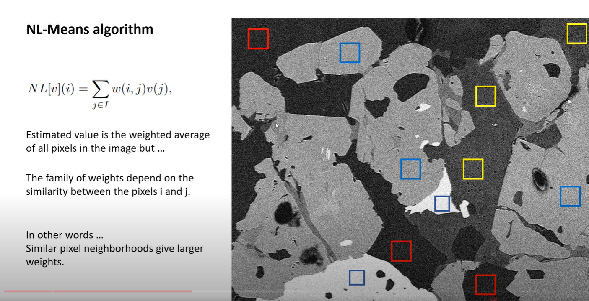

# Non-Local Means
## is a technique for image denoising. It preserves the edges and textures in the image while removing the noise. It is a non-linear filter.
## The idea behind the non-local means algorithm is that if we want to estimate the value of a pixel in an image, we can search for similar pixels in the image and average their values. This is similar to the idea behind the median filter, but instead of using a local window around the pixel to compute the average, we use the entire image. This is why it is called non-local means.

 

