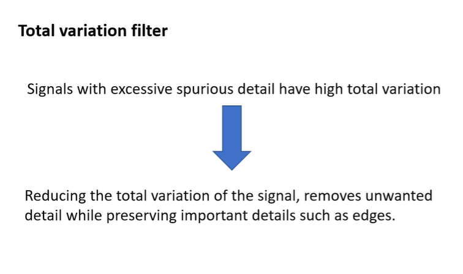

## Total Variation
### Is a method for denoising images. It is based on the principle that signals with excessive and possibly spurious detail have high total variation, that is, the integral of the absolute gradient of the signal is high. According to this principle, reducing the total variation of the signal subject to it being a close match to the original signal, removes unwanted detail whilst preserving important details such as edges.

