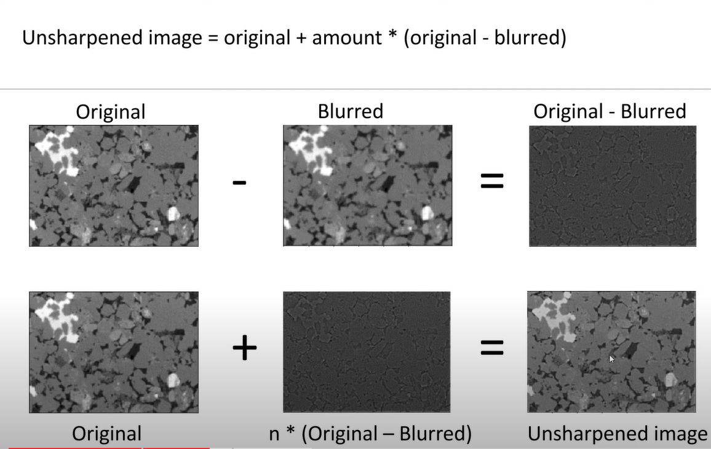

## Unsharp mask
### Unsharp masking is an image processing technique used to enhance the sharpness and details of an image by accentuating the edges. The name "unsharp masking" may sound counterintuitive, but it refers to the process of creating a blurred version of the original image, subtracting it from the original, and then combining the result with the original image to enhance the edges.

