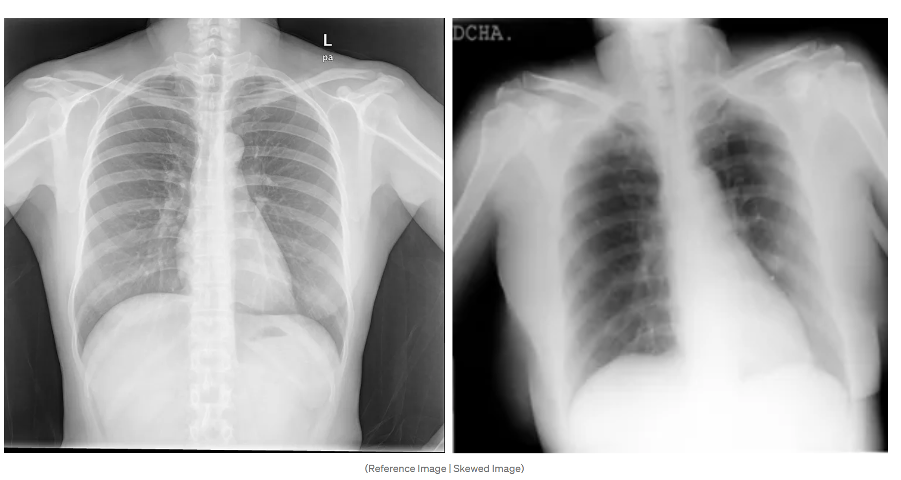

## Image Registration in Medical Imaging
### - Image Regstration coprises 2 images:
- ### Reference Image: 
    - The image that is used as a reference for the registration process.
- ### Skewed Image: 
    - Skewed images refer to images that are slanted, tilted, or off-center in some way. This can occur when a picture is taken at an angle, or when a document is scanned or photographed crookedly. Skewed images can cause problems in various applications, such as image processing, computer vision, and optical character recognition (OCR). To correct skewed images, various techniques and tools can be used, such as OpenCV, GIMP, and Hugin, which help in aligning and transforming the images into a more accurate and visually appealing form.

 

 

- ### Methods:
  - ### Chi2 Shift Method: Find the offset between two images using DFT (Discrete Fourier Transform) and the correlation theorem.

  - ### Cross Correlation Method: Use cross correlation and 2nd order tylor expansion to measure the shift. 

  - ### Optical flow based shift:  takes two images and returns a vector field. For every pixel in image 1 you get a vector that tells you where that pixel moved to in image 2. This is a very powerful method that can handle large shifts and even non-rigid deformations.

  - ### Regester translation:  is a method that uses a simple translation model to align two images. It is a very fast method that can be used as a first step in a more complex registration pipeline.

[for more Methods](./Approaches%20to%20Fixing%20Skewed%20Images-Image%20Registration.pdf)