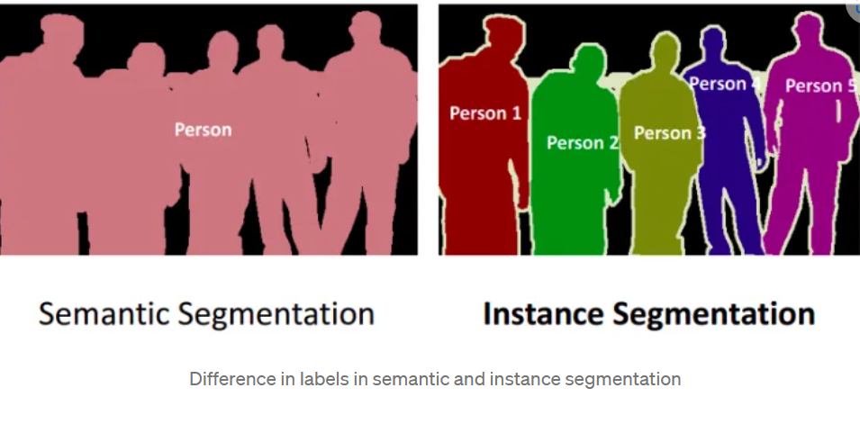
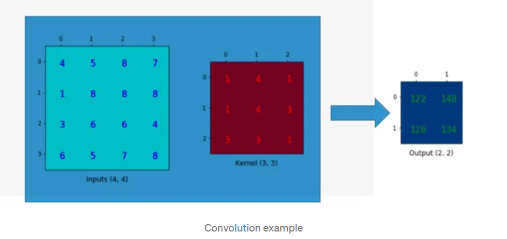
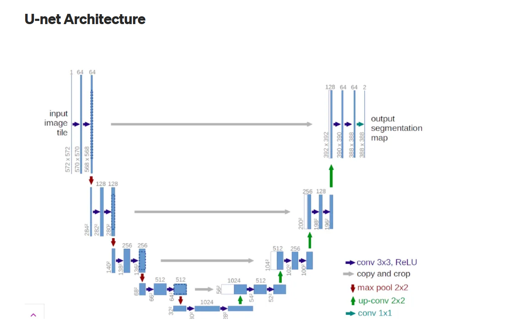
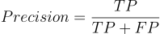
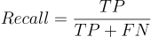
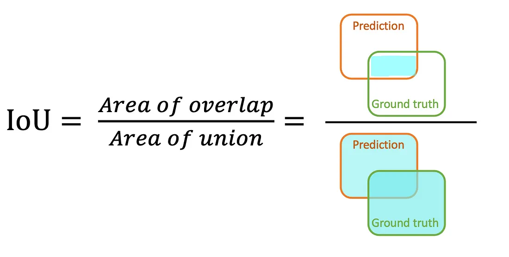
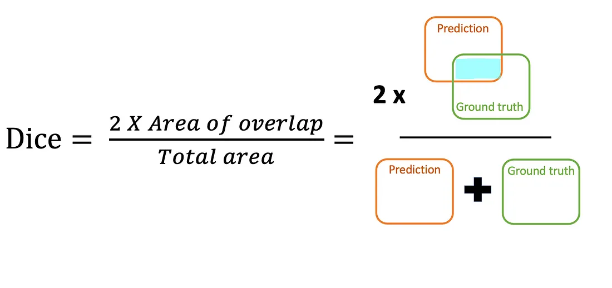

# U-NET

## Semantic segmentation:
### is to label each pixel of image with corresponding class of what is being represented. That is it refers to the process of linking each pixel in an image to a class label. These labels could include a person, car, flower, piece of furniture, etc., just to mention a few.

<br />

## Instance segmentation:
### Along with pixel level classification, we expect the computer to classify each instance of class separately. It is called instance segmentation.That is different instances of the same class are segmented individually in instance segmentation.

<br />



<br />

## Convolution:



<br />

### Here we used a (3 x 3) kernel with an (4 x 4) input to generate a (2 x 2) output. Here we have zero padding and we are using striding as 1. The output of convolution entirely depends on kernel size, padding ,striding and no of input.

<br />

### - __Zero padding__: refers to adding a border of pixels with zero values around the edges of an image. This technique is commonly used in convolutional neural networks to preserve features that exist at the edges of the original image and control the size of the output feature map.

<br />

## __U-Net Architecture:__



<br />

### 1. Contraction/down sampling path(Encoder Path): __To Extract features__. 
- ### The encoding path is composed of 4 blocks.
- ### Each block  cosist of: 
    1. ### Two 3 x 3 convolution layers + ReLU activation function (with batch normalization). 
    2. ### One 2 x 2 max pooling layer.
    - ### Note that in the original paper, the size of the input image is 572 x 572 x 3. Using 64 (3 x 3) kernels, convolution is done and produce a feature map of 570 x 570 x 64. Now it is again multiplied with 64(3 x 3) kernels and produce feature map of 568 x 568 x 64. Now a max pooling is done using 2 x 2 kernel to produce feature map of 284 x 284 x 64.
    - ### We have to note that the number of feature maps doubles at each pooling, starting with 64 feature maps for the first block, 128 for the second, and so on. The purpose of this contracting path is to capture the context of the input image in order to be able to do segmentation.

### 2. Expansion/Up sampling path(Decoder Path): __reconstruct an image from the compact representation.__
- ### The expansion path consists of 4 blocks. Each block consists of:
    1. ### Deconvolution layer with stride 2.
    2. ### Concatenation with the corresponding cropped feature map from the contracting path. ie To get better precise locations, at every step of the decoder we use skip connections by concatenating the output of the transposed convolution layers with the feature maps from the Encoder at the same level.
    3. ### Two 3 x 3 convolution layers + ReLU activation function (with batch normalization).

<br />

### 3.  copy and crop (Skip connections):
### The important point is that for autoencoders the encoder and decoder must be separate. Otherwise, it defeats the entire point of image compression. For semantic segmentation, we do not have this restriction.
### In a U-Net, skip connections are used to pass information from earlier convolutional layers to the deconvolution layers. Critically, what is passed is the location of the feature extracted by convolutional layers. That is the skip connections tell the network where in the image the features come from.
### This is done by concatenating the last layer in the convolutional block and the first layer of the opposite deconvolutional block. The U-Net is symmetrical — the dimensions of the opposite layers will be the same. As seen in Figure 9, this makes it easy to combine the layers into a single tensor. Convolution is then done as usual by running the kernel over the single concatenated tensor.


<br />

### This concatenation is at the heart of the U-Net. It combines two important pieces of information:

- ### __Feature extraction__ — features are passed from the previous layer to the upsampled layer.

- ### __Feature localization__ — the location of the feature is passed from the opposite convolution layer.

<br />


## To calculate the number of parameters, we need to consider the following:

```
params = (kernel_height * kernel_width * input_channels * output_channels) + output_channels

```

### 1. Let's calculate the output shape and the number of parameters step by step:

1. ### Output Shape:

- ### The input shape is (128, 128, input_channels).
- ### The first Conv2D layer is applied to the input, resulting in an output shape of (128, 128, num_filters), which is (128, 128, 16) in this case.

2. ### Number of Parameters:
- ### For the first Conv2D layer:
    - ### kernel_height and kernel_width are both 3.
    - ### input_channels is the number of channels in the input, which is input_channels.
    - ### output_channels is num_filters, which is 16.
    - ### Therefore, the number of parameters for the first Conv2D layer is:
    ```
    params = (3 * 3 * input_channels * 16) + 16
       = 144 * input_channels + 16 = 144 * 3 + 16 = 448
    ```

<br />

### To calculate the number of parameters for the second Conv2D layer:

```
params = (kernel_height * kernel_width * input_channels * output_channels) + output_channels
```

<br />

### In this case, the kernel_height and kernel_width are both 3, the input_channels is equal to num_filters, and the output_channels is also num_filters.

<br />

```
params = (3 * 3 * num_filters * num_filters) + num_filters
       = 9 * num_filters^2 + num_filters
```

<br />

### If num_filters is 16, the number of parameters for the second Conv2D layer would be:

```
params = 9 * 16^2 + 16
       = 2304 + 16
       = 2320

```


<br />


### Evaluation Metrics:

### 1. __Percision and Recall (Sensitivity):__
- ### Precision score is the number of true positive results divided by the number of all positive results.




<br />

- ### Recall score, also known as Sensitivity or true positive rate, is the number of true positive results divided by the number of all samples that should have been identified as positive



<br />

```python

def precision_score_(groundtruth_mask, pred_mask):
    intersect = np.sum(pred_mask*groundtruth_mask)
    total_pixel_pred = np.sum(pred_mask)
    precision = np.mean(intersect/total_pixel_pred)
    return round(precision, 3)

def recall_score_(groundtruth_mask, pred_mask):
    intersect = np.sum(pred_mask*groundtruth_mask)
    total_pixel_truth = np.sum(groundtruth_mask)
    recall = np.mean(intersect/total_pixel_truth)
    return round(recall, 3)
```

<br />


### 2. __Jacard Index (Intersection over Union, IoU):__
### is the area of the intersection over union of the predicted segmentation and the ground truth. 



<br />

```python
def iou(groundtruth_mask, pred_mask):
    intersect = np.sum(pred_mask*groundtruth_mask)
    union = np.sum(pred_mask) + np.sum(groundtruth_mask) - intersect
    iou = np.mean(intersect/union)
    return round(iou, 3)
```


<br />

### 3. __Dice Coefficient:__
### F-measure, also called F-score.
### Dice coefficient is calculated from the precision and recall of a prediction. Then, it scores the overlap between predicted segmentation and ground truth.
### Range from 0 to 1, where a Dice coefficient of 1 denotes perfect and complete overlap.




<br />

```python  
def dice_coef(groundtruth_mask, pred_mask):
    intersect = np.sum(pred_mask*groundtruth_mask)
    total_sum = np.sum(pred_mask) + np.sum(groundtruth_mask)
    dice = np.mean(2*intersect/total_sum)
    return round(dice, 3) #round up to 3 decimal places
```

### the Difference between IoU and Dice Coefficient is that the IoU is used to measure the overlap between two bounding boxes while the Dice Coefficient is used to measure the overlap between two masks.


<br />


### 5. __Dice Loss:__
### Dice loss is a metric used to calculate the similarity (or dissimilarity) between two sample sets. It is commonly used in image segmentation, where it is also called Sørensen–Dice coefficient or Dice similarity coefficient.

## Formula:
### Dice Loss = 1 - Dice Coefficient

<br />

```python
def dice_loss(groundtruth_mask, pred_mask):
    loss = 1 - dice_coef(groundtruth_mask, pred_mask)
    return loss
```

