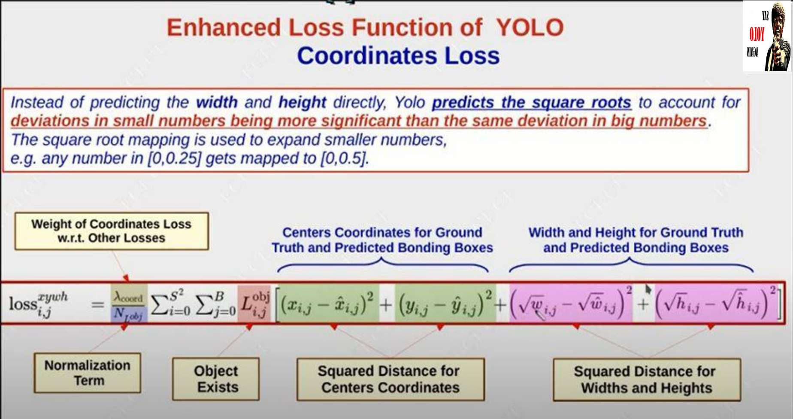

# Object Detection

## -  __TERINOLOGIES:__
- ### __Object Detection:__ Object detection is a computer vision technique whose aim is to detect objects such as cars, buildings, and human beings, just to mention a few. In this technique, we draw a bounding box around the object of interest and classify that object into a particular class.

 

### 1.  __Image Classification:__ Image classification is a computer vision technique that categorizes images into different classes. Predict the type or class of an object in an image.
- ### __Input:__ An image with a single object, such as a photograph.
- ### __Output:__ A class label (e.g. one or more integers that are mapped to class labels).

 

### 2. __Object Localization:__ Locate the objects in an image and output their location with a bounding box.
- ### __Input:__ An image with one or more objects, such as a photograph.
- ### __Output:__ One or more bounding boxes (e.g. defined by a point, width, and height).

 

### 3. __Object Detection:__ Locate the objects in an image and output their location with a bounding box and class label.
- ### __Input:__ An image with one or more objects, such as a photograph.
- ### __Output:__ One or more bounding boxes (e.g. defined by a point, width, and height) and their class labels.

- ### __Boundig Box:__ A bounding box is a rectangular box that can be determined by the x and y axis coordinates in the upper-left corner and the x and y axis coordinates in the lower-right corner of the rectangle.

### - Bouinding Box are parameterized with (x,y,w,h,confidence) where x,y are the coordinates of the center of the box, w,h are the width and height of the box and confidence is the probability that the box contains an object of interest.

 

## __Challenges in Object Detection:__
- ### __1. Muliple Outputs:__ in case of image classification we have only one output but in case of object detection we have multiple outputs. So we need to build model taht can output variably sized number of detections.

- ### Types: 
    ### a. Category: The category of the object in the image.
    ### b. Bounding Box: The coordinates of the bounding box around the object.

- ### __2. Computationally Expensive:__ For object detection it typically requires to work on high resolution images. As we want to identify lot of different objects in image, we want enough spatial resolution on each of the objects so overall resolution of image needs to be quite higher.

 

## __Region Proposal:__
### are candidates that might have objects within them. The number of these regions is usually in the several thousands, e.g. 2,000 or more. Examples of some algorithms that generate region proposals are Selective Search and EdgeBoxes.

 

### From each region proposal, a fixed-length feature vector is extracted using various image descriptors like the histogram of oriented gradients (HOG), for example. This feature vector is critical to the success of the object detectors. The vector should adequately describe an object even if it varies due to some transformation, like scale or translation.

 

 

### The feature vector is then used to assign each region proposal to either the background class or to one of the object classes. As the number of classes increases, the complexity of building a model that can differentiate between all of these objects increases. One of the popular models used for classifying the region proposals is the support vector machine (SVM).

 

## __Regon-Based Convolutional Neural Networks (R-CNN):__
### Compared to the generic pipeline of the object detection techniques shown in the previous figure, the main contribution of R-CNN  is just extracting the features based on a convolutional neural network (CNN). Other than this, everything is similar to the generic object detection pipeline. The next figure shows the working of the R-CNN model.

 

 

### - Working of RCNN:
### ___Step1:___ We start with input image and run region proposal method like selective search, by which we get 2,000 candidate region proposals in image that we need to evaluate.

### ___Step2:___ For each candidate regions, as region proposals can be of different sizes and different aspect ratio, so we are going to warp that region into fixed size, say (224x224).

### ___Step3:___ For each warped image regions, we are going to run them independently through Convolutional Neural Network (CNN) and that CNN will output classification score for each of these regions.

 

>> __Note:__ We are going to use CNN as a feature extractor, so we are not going to use CNN for classification, we are just going to use CNN for extracting features from these regions.

 

### ___Step4:___ We are going to take these features and feed them into SVM classifier, which will classify these regions into one of the classes.

 

### __SLIGHT PROBLEM:__ What happens if region proposals that we get from selective search do not exactly match to the objects that we want to detect in the image?

- ### CNN is going to output additional thing which is transformation that will transform region proposal box into final box that we want to output for object of our interest Finally it would look something like this,

 

### __Step1:__ Run region proposal method to compute 2,000 candidate region proposals.

### __Step2:__ Resize each region to specific size (224x224) and run independently through CNN to predict class scores and bounding box transform.

### __Step3:__ Use scores to select subset of region proposals to output.

### __Step4:__ Compare with the ground truth boxes.

 

### ___How to compare the prediction to ground truth box?___
- ### We can compare these bounding boxes with the metric called Intersection over Union (IOU). IOU is the ratio of the area of intersection of the predicted bounding box and ground truth bounding box to the area of union of the predicted bounding box and ground truth bounding box.

 

> ### __IOU = (Area of Intersection) / (Area of Union)__ 
> ### IOU<0.5 → we say it ‘Bad’ IOU>0.5→ ‘descent’, IOU>0.7 → ‘Good’, IOU>0.9 → ‘Almost perfect’.

 

### ___The object detector often output multiple bounding boxes for same object. So how to solve this?___

- ### We can use Non-Max Suppression (NMS) to solve this problem. NMS is a technique to select the best bounding box out of multiple bounding boxes that overlap with each other.

 

### ___How NMS works?___

1. ### it looks for probabilities (Pc) associated with each of these detection for particular object.
2. ### It takes largest ‘Pc’ which is most confident detection for the object.
3. ### Having done that, the NMS part looks for all remaining bounding boxes and chooses all those bounding boxes which has high Intersection over Union (IOU) with the bounding box of highest ‘Pc’ and suppresses them.
4. ### Then we look for remaining bounding box and find highest ‘Pc’ and again NMS looks for remaining bounding boxes which has high IOU with bounding box of high ‘Pc’ and then they will get suppressed.

 

### 1. It takes largest Pc which is 0.9 in this case.
### 2. It check IOU for all the remaining bounding boxes (i.e. for 0.6, 0.7 for Car 1 and 0.8, 0.7 for Car 2).
### 3. Now, NMS will suppress 0.6 and 0.7 for car 1 as they have high IOU with respect to bounding box of Pc=0.9, so like this we get only one bounding box for car 1 which is highlighted in the image.
### 4. Next, for remaining bounding boxes we have highest Pc=0.8 for car2 and again we check IOU for remaining boxes (i.e. 0.9 for car1 and 0.7 for car2)
### 5. Now, NMS will suppress 0.7 as it has high IOU with respect to bounding box of Pc=0.8. And we get only one bounding box for car 2 as well.

> __NOTE:__ RCNN it is very slow and cannot be used in real-time.

 

## __Fast R-CNN:__

    
    

 

### __Step1:__ Take input image and process whole image with single CNN (without fully connected layers). So the output will be convolutional feature map giving us convolutional features. And this ConvNet we run is often called as backbone network (can be AlexNet, VGG, ResNet, etc.)

### __Step2:__ Run region proposal methods and crop & resize features from ConvNet feature map according to region proposals.

### Step3: Run light CNN (meaning shallow network) per region.

 

### This is going to be fast, as most of the computation is going to happen in the backbone network and network we run on per region is going to be relatively small and light weight and fast to run.

 

### __What does it mean to crop and resize features? How to crop features?__

### It can be done via Region of Interest Pooling (RoI Pooling).
 

### ROI Pooling: It is a type of max pooling to convert features in the projected region of the image of any size, h x w, into a small fixed window, H x W. The input region is divided into H x W grids, approximately every subwindowof size h/H x w/W. Then apply max-pooling in each grid

 

### __EXAMPLE:__

### We are going to perform regoin of interset pooling on an single 8x8 feature map, one region of interset and an output size of 2x2. 

 

### Let’s say we also have a region proposal (top left, bottom right coordinates): (0, 3), (7, 8). In the picture it would look like this:

 

### We divide the region of interest into 2x2 grid and for each grid (because the output size is 2×2) we get:

 

### Note that the size of the region of interest doesn’t have to be perfectly divisible by the number of pooling sections (in this case our RoI is 7×5 and we have 2×2 pooling sections).
### The max values in each of the sections are:

 

### And that’s the output from the Region of Interest pooling layer. Here’s our example presented in form of a nice animation:

 

### The result is that from a list of rectangles with different sizes we can quickly get a list of corresponding feature maps with a fixed size. Note that the dimension of the RoI pooling output doesn’t actually depend on the size of the input feature map nor on the size of the region proposals. It’s determined solely by the number of sections we divide the proposal into.

 

### What’s the benefit of RoI pooling? One of them is processing speed. If there are multiple object proposals on the frame (and usually there’ll be a lot of them), we can still use the same input feature map for all of them. Since computing the convolutions at early stages of processing is very expensive, this approach can save us a lot of time.

 

 

## __Faster R-CNN:__

 

### The way we are going to do that is very similar to Fast RCNN except after we run backbone network we are going to insert a tiny network called Region Proposal Network(RPN) instead of  selectiv search. that will be responsible for predicting region proposals.

 

### Step 1: Run input image through backbone network and get image level features

### Step 2: Pass image level features to RPN to get our region proposals.

### Step 3: Crop the region proposals by ROI Pooling

### Step 4: Pass warped feature to light CNN for predicting final classification and bounding box transformations

 

### __Here the question is how we can use CNN to output region proposals ?__

 

### The CNN image features coming out of backbone network are all aligned to positions in the input. So, then what we can do is each point in CNN feature map we can imagine anchor box which just slides around the image and we place anchor box at every position in CNN feature map coming out of backbone network.

 

### Now, our task is to train little CNN that will classify these anchor boxes as either containing an object or not containing an object.

 

### __Here we have one problem, so the question is, What if anchor box may have wrong shape or aspect ratio?__

- ### we use ‘k’ different anchor boxes which are of different shape and different aspect ratio at each point in an image. So, scale, size, number of anchor boxes are the hyper-parameters for object detection.

 

### - Faster-RCNN is two staged process:

### __1st stage: Object Detector consisting:__
### - Backbone Network
### - Region Proposal Network (RPN)

### __2nd stage: Run once per Region where we,__
### - Crop and Warp features using RoI Pooling
### - predict Object Class. 
### - predict Bounding Box Transformations.

 

 

RCNN vs fast RCNN vs faster RCNN: 

R-CNN: The original R-CNN model uses Selective Search to extract regions of interest (ROIs) from an input image, which may represent the boundaries of objects in the image. Each ROI is then fed through a neural network to produce output features, which are then classified using support-vector machine classifiers. However, R-CNN is slow in both training and testing due to the need to process around 2000 regions per image.
Fast R-CNN: This model improves upon R-CNN by introducing a more efficient method for classifying object proposals using deep convolutional networks. Fast R-CNN trains the VGG16 network 9x faster than R-CNN, is 213x faster at test-time, and achieves a higher mean average precision (mAP) on PASCAL VOC 2012. The main innovation in Fast R-CNN is the use of a technique called Region of Interest (ROI) pooling, which allows the network to process the entire image at once, rather than processing each region proposal separately. This results in faster training and detection times compared to R-CNN.
Faster R-CNN: This model further improves upon Fast R-CNN by introducing a Region Proposal Network (RPN) to generate ROIs, which is much faster than the Selective Search algorithm used in R-CNN and Fast R-CNN. The RPN is a fully convolutional network that simultaneously predicts object bounds and objectness scores at each position. Faster R-CNN is faster in terms of detection time compared to both R-CNN and Fast R-CNN and has better accuracy.
In summary, the main differences between the three models are as follows:
R-CNN uses Selective Search for generating ROIs and processes each region proposal separately, resulting in slow training and testing times.
Fast R-CNN introduces ROI pooling for more efficient classification of object proposals and processes the entire image at once, leading to faster training and detection times compared to R-CNN.
Faster R-CNN replaces Selective Search with a Region Proposal Network (RPN) for generating ROIs, further speeding up the detection process and improving accuracy compared to Fast R-CNN.

-----------------------------------------

## YOLO (You Only Look Once)

 

 

### __Why the name 'You Only Look Once'?__
### As typical for object detectors, the features learned by the convolutional layers are passed onto a classifier which makes the detection prediction. In YOLO, the prediction is based on a convolutional layer that uses 1×1 convolutions. The YOLO algorithm is named “you only look once” because its prediction uses 1×1 convolutions; this means that the size of the prediction map is exactly the size of the feature map before it.

 

### IOU (Intersection over Union): It is a measure of the overlap between two bounding boxes. It is calculated by dividing the area of intersection of two bounding boxes by the area of union of two bounding boxes. It is used in non-max suppression to remove overlapping bounding boxes.

 

### __How YOLO works?__

### 1. __Residual blocks:__
- ### the image is divided into various grids. Each grid has a dimension of S x S.
- ### Every grid cell will detect objects that appear withinthem. For example, if an object center appears within a certain grid cell, then this cell will be responsible for detecting it.

 

### 2. __Bounding box Regression:__
- ###  A bounding box is an outline that highlights an object in an image.
- ### Every bounding box in the image consists of the following attributes:
  - ### Width (bw).
  - ### Height (bh).
  - ###  Class (for example, person, car, etc.)- This is represented by the letter c.
  - ### Bounding box center (bx,by)
    - ### Confidence score (pc) - This score indicates the probability of an object being present in the bounding box.

- ### YOLO uses a single bounding box regression to predict the height, width,center, and class of objects.

 

### __Grid cells:__

    
    

 

### __YOLO Steps:__

 

 

### __One Anchor Box:__
- ### One Grid cell can have only one object.
- ### Max Number of Detected Objects = Cell Count.
- ### Each Object in training image is assigned to grid cell that contains object center.

###  __Multiple Anchor Boxes:__
- ### Select Anchor Box Similar to Each Object. (Size and Aspect Ratio).
- ### Each Anchor Box will be associated with (Object X,Y,W,H, Object class type). And the Confidence score will be calculated based on the IOU between the predicted bounding box and the ground truth bounding box.

 

 

> __NOTE__ for each object bounding box we select the anchor box with the highest IOU.

 

> __NOTE__ Best Anchor size  we can use [Average - Center ] or [Median] od Each Cluster.

 

    
    

 

### __Non-Max Suppression:__
- ### It is a technique used to remove redundant bounding boxes.

    
    

 
 

### __YOLO Loss Function:__

 

    
    

 

    
    

 

    
    

 

 

### __MEAN AVERAGE PRECISION (mAP):__ is used to evaluate the performance of an object detector on a particular dataset. It is calculated as the average of AP calculated for all the classes in the dataset.
- ### __True Positive (TP):__  These are predicted bounding boxes with IOU > 0.5 with the target bouniding box for  agiven class.
- ### __False Positive (FP):__  These are predicted bounding boxes with IOU < 0.5 with the target bouniding box for  agiven class.
- ### __False Negative (FN):__  There are no predicted boouniding boxes for a target bouniding box.

    
    

 

    
    

<<<<<<< HEAD

 

### __YOLO v1:__
### uses features from the entire image and predicts bounding boxes simultaneously. The image is divided into S X S grid and each gird produces B bounding boxes and their confidence scores. These confidence scores reflect how confident the model is that the box contains an object and also how accurate it thinks the box is that it predicts. These confidence scores reflect how confident the model is that the box contains an object and also how accurate it thinks the box is that it predicts. Each bounding box consists of 5 predictions: x, y, w, h, and confidence. The (x, y) coordinates represent the center of the box relative to the bounds of the grid cell. The width and height are predicted relative to the whole image. Finally, the confidence prediction represents the IOU between the predicted box and any ground truth box.

 

 

### YOLO has 24 convolutional layers followed by 2 fully connected layers (FC). Some convolution layers use 1 × 1 reduction layers alternatively to reduce the depth of the features maps. For the last convolution layer, it outputs a tensor with shape (7, 7, 1024). The tensor is then flattened. Using 2 fully connected layers as a form of linear regression, it outputs 7×7×30 parameters and then reshapes to (7, 7, 30), i.e. 2 boundary box predictions per location.

 

> ### __NOTE:__ Class confidence score = box confidence score * conditional class probability.
> ### It measure the confidence on both the classification and the localization.
> ### Box confidence score = Pr(Object) * IOU.
> ### Conditional class probability = Pr(Class | Object).
> ### Class confidence score = pr(class) * IOU. = box confidence score * conditional class probability.
> ### where: 
> ### Pr(object) is the probability that an object exists in the bounding box.
> ### IOU is the intersection over union between the predicted bounding box and the ground truth bounding box.
> ### Pr(class|object) is the probability that the object belongs to a particular class.
> ### Pr(class) is the probability that a particular class exists in the image.

 

### __YOLO v3:__
- ### YOLO v3 uses a variant of Darknet, which originally has 53 layer network trained on Imagenet.
- ### 53 more layers are stacked on top, giving us a 106 layer fully convolutional underlying architecture for YOLO v3.

### __Darknet-53:__

### YOLO v2 introduced darknet-19, which is 19-layer network supplemented with 11 more layers for object detection. However, having a 30-layer architecture, YOLO v2 often struggled at detecting small objects. Therefore, the authors introduce successive 3 × 3 and 1 × 1 convolutional layers followed by some shortcut connections allowing the network be much deeper. Thus, the authors introduce their Darknet-53, which is shown below.

 

    
   

 

 

### in YOLO v3: 
- ### No Pooling layers.
- ### Convolutional layers instead. 
- ### Prevents loss of low-level features.
- ### Ability to detect small objects.

  

    
   

 

### There are 3 scales in YOLO v3:
- ### 32 at the layer 82.
- ### 16 at the layer 94.
- ### 8 at the layer 106.
### - The size of the outputs: 
- ### 13 x 13 at the layer 82.
- ### 26 x 26 at the layer 94.
- ### 52 x 52 at the layer 106.

 

### At each scale, there are 3 anchor boxes. Therefore, the total number of anchor boxes is 9. 

 

> ### __NOTE:__ b = 3 means that there are 3 anchor boxes at each scale. and 255 the depth of the output tensor. 255 = 3 * (4 + 1 + 80) where 4 is the number of bounding box attributes, 1 is the object confidence and 80 is the number of classes.
