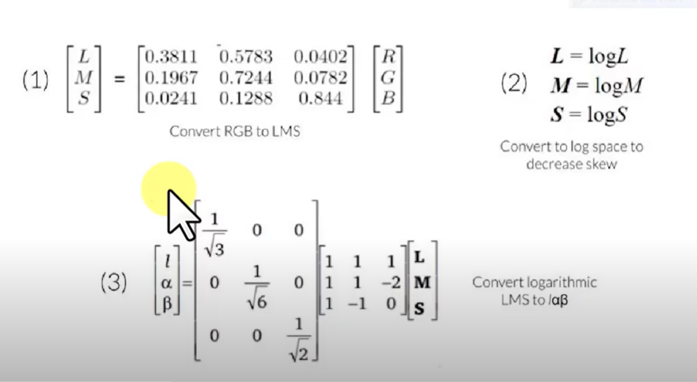
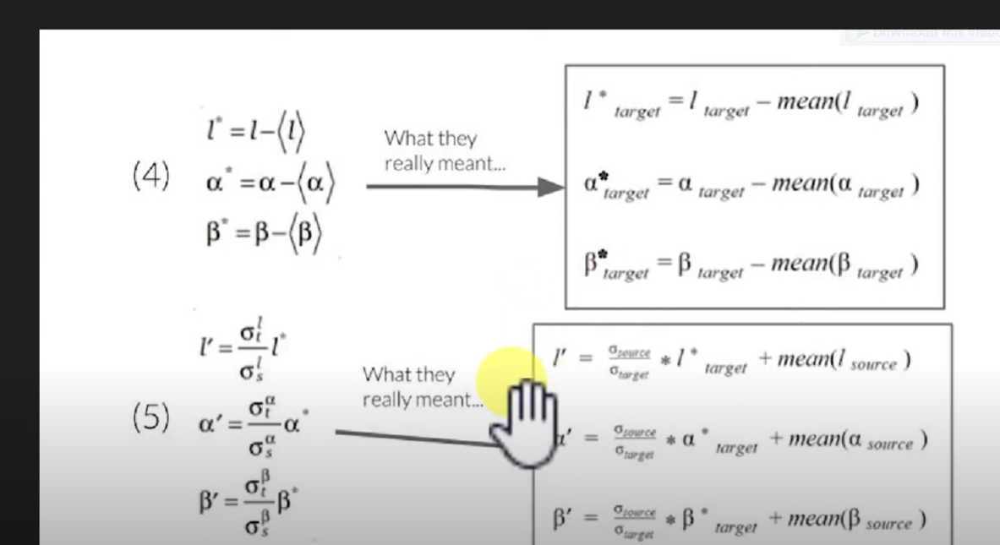

## Reinhard color transformation
### we can use it for exmaple to add more images to the dataset.

### The color transfer algorithm proposed in the paper works by aligning the color distributions of the source and target images. It involves mapping the color statistics of the source image to match those of the target image while maintaining the spatial relationship between pixels.

### Step1 : to get [L M S] matrix of image we need to multiply the image by matrx [r g b].
### step2 : Convert the lab space to the log space to decrease the skewness of the data.

### step3 : we convert the log space to the lab space. 

### step4 : we take each channel of the image and calculate the mean and standard deviation of the channel. by subtracting each channel from mean from the target image. 

### step5 : we claculate the mean and standard deviation of the source and target image then multiply it by the lab space from step 4 and add the mean of the source image.

for more information about the algorithm you can check the paper [Color Transfer between Images](https://www.cs.tau.ac.il/~turkel/imagepapers/ColorTransfer.pdf)