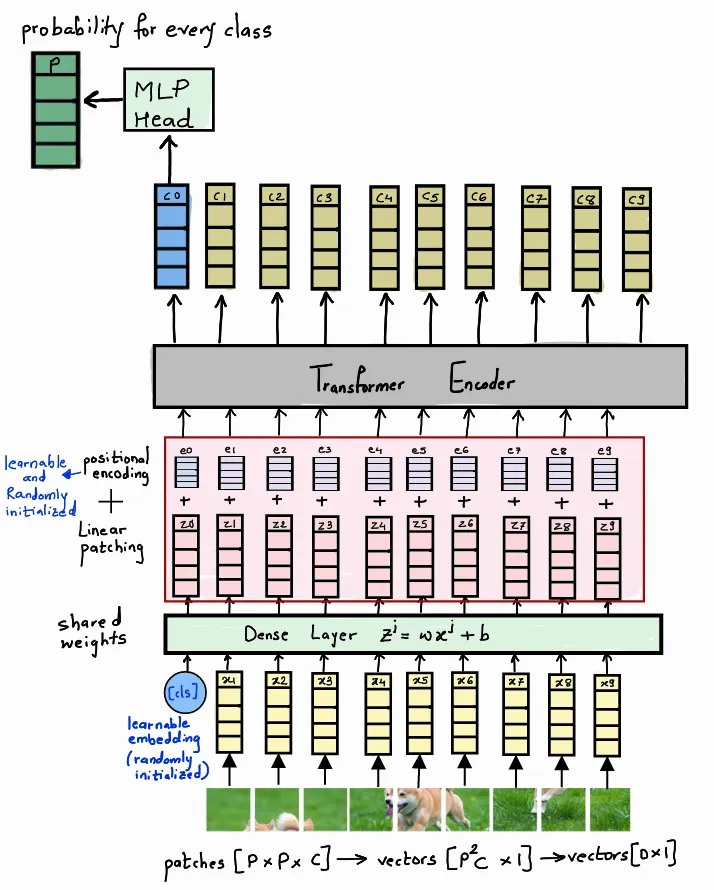

### Vision Transformers

#### Limitations of CNNs in Computer Vision
1. CNNs are not translation invariant. This means that if we shift an image by a few pixels, the model will not be able to recognize it. This is because the model is trained on a fixed size image and it expects the image to be in the same position as it was during training.
2. The order of the features in the image is not preserved. This means that if we swap the position of two features in the image, the model will not be able to recognize it. This is because the model is trained on a fixed size image and it expects the features to be in the same order as they were during training.

### ViT vs. Convolutional Neural Networks
#### The ViT model represents an input image as a series of image patches, like the series of word embeddings used when using transformers to text, and directly predicts class labels for the image.

#### ViT has more similarity between the representations obtained in shallow and deep layers compared to CNNs.
#### Unlike CNNs, ViT obtains the global representation from the shallow layers, but the local representation obtained from the shallow layers is also important.
### Skip connections in ViT are even more influential than in CNNs (ResNet) and substantially impact the performance and similarity of representations.
### ViT retains more spatial information than ResNet
#### ViT can learn high-quality intermediate representations with large amounts of data.
#### MLP-Mixer’s representation is closer to ViT than to ResNet

#### What is a Vision Transformer?
A Vision Transformer (ViT) is a Transformer architecture that is applied to image classification tasks. It replaces the convolutional layers that are typically used in computer vision architectures with multi-head self-attention. This allows the model to learn global relationships between pixels in an image, which is important for image classification tasks.

#### To understand the architecture better, let us divide it into 3 components.
1. #### Emebdding: In this step, we divide the input image into fixed-size patches of [P, P] dimension and linearly flatten them out, by concatenating the channels (if present). For example, a patch of size [P, P, C] is converted to [P*P*C, 1]. This linearly flattened patch is further passed through a Feed-Forward layer with a linear activation function to get a linear patch projection of the dimension [D, 1]. D is the hyperparameter called as embedding dimension used throughout the transformer.

#### The image can be patched using a Convolutional Layer by keeping the stride equal to the patch size. This will convert the input image into patches of the required size, which are then flattened and passed to the next layer.

#### For classification purposes, taking inspiration from the original BERT paper, we concatenate a learnable class embedding with the other patch projections, whose state at the output serves as class information. This extra class token is added to the set of image tokens which is responsible for aggregating global image information and final classification. It is able to learn this global aggregation while it passes and learns through the attention layers. We also add a 1D positional embedding to the linear patches, to establish a certain order in the input patches.

### Why is positional encoding necessary?
#### Transformers are not capable of remembering the order or sequence of the inputs. If the image patches are re-ordered the meaning of the original image is lost. Hence, we add a positional embedding to our linearly embedded image patches to keep track of the sequence. This positional embedding is added to the input of the encoder and decoder layers. The positional embedding is a vector of size [N, D] where N is the number of patches and D is the embedding dimension. The positional embedding is added to the linear patch embedding before passing it to the encoder layers.

#### To understand the embedding step a bit better let us see the dimensions.

#### Suppose, we have an input image of size 224x224x1, we divide it into fixed-size patches of size 16x16. Let us denote the patch size as P and the image channels as C. The total number of patches N that we get is 196. 

#### `Number of patches N = (W/P) * (H/P) = (224/16) * (224/16) = 196`

#### After linearly flattening all the patches to get a vector X of dimension [N, P²C]., we pass it through a Dense Layer to convert it to a D dimensional vector called embedding E [N, D]. We then append a learnable class embedding [1, D] to convert the E vector to dimension [N+1, D]. The last step is adding positional encoding to get the final vector Z. Both the class and positional embeddings are randomly initialized vectors, learned during the training of the network.

#### Once we have our vector Z we pass it through a Transfomer encoder layer.

### Step 2: Transformer Encoder:
#### The Transformer Encoder architecture is similar to the one mentioned in the “ATTENTION IS ALL YOU NEED” paper. It is composed of multiple stacks of identical blocks. Each block has a Multi-Head Attention layer followed by a Feed-Forward layer. There is a residual connection around each of the two sub-layers, followed by layer normalization. All sub-layers as well as the embedding layers in the model produce an output of embedded dimension D. The Z vector from the previous step is passed through the transformer Encoder architecture to get the context vector C.

### The Transformer Encoder architecture consists of multiple encoder blocks, where each block has a Multi-Head Attention unit and a Feed-Forward Network. Each layer is also followed by a normalization layer.

#### Assuming that we already are aware of the mechanism of a Feed-Forward layer, let us look at the Multi-Head Attention.

### Multi-Head Attention:
#### Multi-Head Attention is a mechanism that allows the model to jointly attend to information from different representation subspaces at different positions. It uses 3 different linear projections of the input embeddings to generate the Query, Key, and Value vectors. These vectors are then passed through a scaled dot-product attention layer to get the output. The output of all the attention heads is concatenated and passed through a linear layer to get the final output. The Multi-Head Attention layer is followed by a residual connection and a normalization layer.

#### Dimension for Multi-Head Attention Block

#### The main component of a Multi-Head Attention unit is the Scaled Dot-Product Attention. At first, the input vector Z is duplicated 3 times and multiplied by weights Wq, Wk, and Wv, to get the Queries, Keys, and Values respectively. The Queries are then multiplied by the Keys, and the result is divided by the square root of the dimension, to avoid the vanishing gradient problem. This matrix goes through a Softmax layer and gets multiplied by the Values to give us the final output called Head H.

#### Dimensions for Attention Block

	

#### The Scaled Dot-Product Attention as explained above is applied h times (h=8) to get h attention heads. These attention heads are concatenated and passed through a dense Layer to get the final vector of embedded dimension D.

#### The output of the Multi-Head Attention layer is passed through a Feed-Forward layer to get the final output of the encoder block. The output of the encoder block is passed to the next encoder block. The output of the last encoder block is the context vector C. (Coming back to our transformer encoder architecture, the Z vector passes through multiple Encoder Blocks to give us the final context vector C.)

### Step 3: Classification Head: (MLP Head):
#### Once, we have our context vector C, we are only interested in the context token c0 for classification purposes. This context token c0 is passed through an MLP head to give us the final probability vector to help predict the class. The MLP head is implemented with one hidden layer and tanh as non-linearity at the pre-training stage and by a single linear layer at the fine-tuning stage.

#### The final architecture is shown in the diagram above. The linear image patches are appended by a [CLS] token and passed through a Dense Layer to get the final encoding vector Z along with positional embeddings. This is then passed through a Transformer encoder architecture to get the context vector C. The value of the context token c0 is passed through an MLP head to get the final prediction.

### Self-supervised learning is a type of machine learning where the data itself provides supervision, without requiring any explicit external labels. In the context of Vision Transformers (ViT), self-supervision can be particularly useful for pre-training the model to understand and represent visual data. One common method to perform self-supervised learning in ViT is via "Masked Patch Prediction," which can be likened to the concept of "Masked Language Modeling" in Natural Language Processing (NLP) tasks.

### How Masked Patch Prediction Works in ViT:

1. **Patch Extraction**: The first step is to divide an image into small patches. These patches are then linearly embedded to create a sequence of vectors. This sequence of patch embeddings serves as the input to the Vision Transformer.

2. **Masking**: Random patches in this sequence are masked or hidden from the model, typically by setting them to zero or replacing them with a special "mask" token. These masked patches become the targets that the model must predict, providing a form of self-supervision.

3. **Encoding**: The sequence of patch embeddings, including the masked ones, are fed into the Vision Transformer. Like other Transformer models, ViT has an encoder consisting of multiple layers with self-attention mechanisms and feed-forward neural networks.

4. **Prediction**: During the forward pass, the model predicts the content of the masked patches. The idea is to predict the original features of the masked patch based on the contextual information provided by the remaining, unmasked patches.

5. **Loss Calculation**: The loss is calculated by comparing the predicted patches to the true patches that were masked out. The loss function is usually mean squared error (MSE) or some other similarity metric that measures the difference between the predicted and actual patches.

6. **Backpropagation**: The gradients are backpropagated through the network to update the model parameters, helping it to learn the representations for better patch prediction.

7. **Iteration**: Steps 2-6 are repeated for many epochs, allowing the model to iteratively improve its ability to predict masked patches.

After the model is sufficiently trained using this self-supervised approach, it can be fine-tuned for specific downstream tasks like image classification, object detection, or semantic segmentation, using a smaller labeled dataset.

The self-supervised Masked Patch Prediction method allows the model to learn useful, high-level features from visual data without requiring explicit labels. This is highly beneficial when you have a large dataset of unannotated images but only a small dataset of labeled samples for your specific task. In this case, you can pre-train the model using the unannotated dataset, then fine-tune it for your task using the smaller labeled dataset. This approach is known as transfer learning, and it can help you achieve better results with less labeled data.

